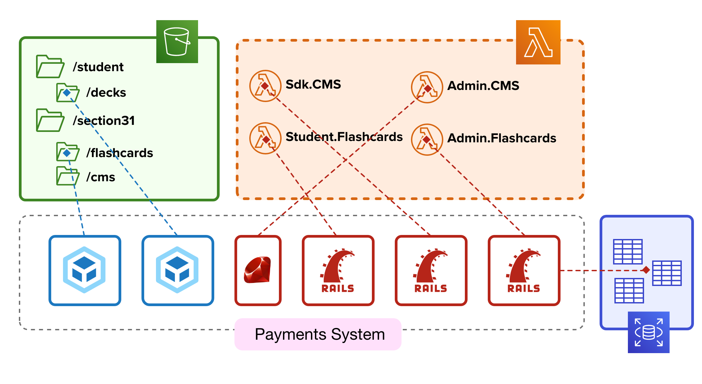

# Introduction to Systems Development

The flexbility of TeacherSeat to meet any use-case is due to its architecture around systems.
Systems allow you to extend the functionality of your learning platform.

## The Boundaries of a System

A system is made up of a collection of isolate programming libraries each with their own standards that could include:

* Student System and Student Interface
* Admin System and Admin Interface
* SDK System
* System Plugins

### Student Panel

The Student panel is composed of two isolate web-applications:
- Student System (Backend)
- Student Interface (Frontend)

#### Student System 

Represents the backend (API and business logic) for a system in the namespace of the Student Panel 

#### Student Interface 

Represents the visual representation (frontend) of the Student Panel.

- The default student interfaces are built using the [Dilithium](https://github.com/ExamProCo/dilithium.js) javascript web-framework.
- Any javascript framework can be used to build the frontend to your system (eg. React) because all student interfaces are isolate from each other.
- Student Interfaces are only bound to the standards defined in their theme package. There are no hard restrictions.

### Admin Panel

The Admin panel is composed of two isolate web-applications:
- Admin System (Backend)
- Admin Interface (Frontend)

#### Admin System 

Represents the backend (API and business logic( for a system in the namespace of the Admin Panel  |

#### Admin Interface 

- Admin Interfaces are always built using the [Dilithium](https://github.com/ExamProCo/dilithium.js) javascript web-framework
- Admin Interfaces must adhere to the strict Styling and UX TeacherSeat guidelines.

### SDK System

Represents the API for programmatic access for external integrations 

### System Plugins

Represents smallar libaries of code to be used within a Backend Student or Admin System.
