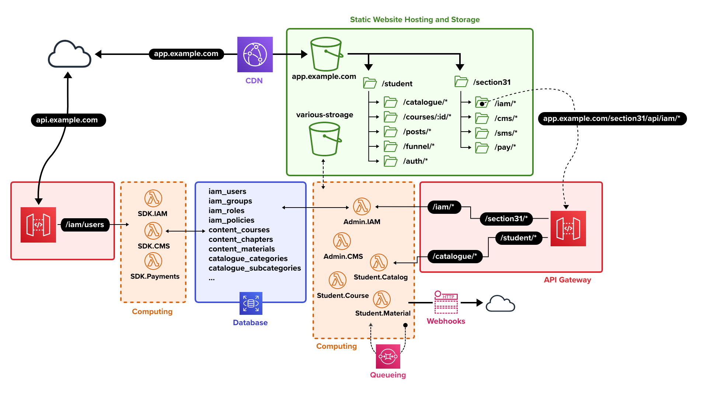

# TeacherSeat Architecture

TeacherSeat utilizes serverless compute and storage 

## CDN  

When you access the learning platform (eg. `app.example.com`) traffic is pointed to CloudFront. CloudFront is a content distribution network (cdn) and it will cache common requests for assests (eg html, js, css and images) to various edge locations around the world. This ensures your website loads very in all avaliable regions. We can also apply a free SSL certficiate via Amazon Certification Manager (ACM) directly to CloudFront.

## Static Website Hosting

The frontend of our website is stored in an S3 bucket with S3 Static Website Hosting enabled. CloudFront directly all traffic to this S3 bucket. Within the S3 bucket are two folders:
- /section31 — This conains all our Admin Interfaces
- /student  — This conains all our Student Interfaces

An Interface is a web-application (most likely using Dilithium.js web-application framework) scoped for a specific TeacherSeat system.

## API Gateway

The way our frontend (Interface) communicates with our backend (System) is via an API Gateway. AWS API Gateway defines API endpoints that route HTTP/s requests to Systems that reside in computing resources. AWS API Gateway also has addtional controls such as:
- Request Throttling to mitigate API abuse
- CORS to ensure requests only originate from trusted domains
- AWS WAF can be attached to block or monitor common web attacks

## Serverless Compute

Requests are processed and responses are returned utilizing serverless compute via AWS Lambda. The learning platform is divided into Systems. Systems are Ruby on Rails applications that are namespaced either for the Admin or Student Panel and are scoped for a very specific domain. (eg. Payments)

Traditionally with serverless compute utilizing full web-frameworks like Ruby on Rails was not possible or advised for serverless architecure. However recently immprovements with AWS Lamda and open-source project now make serverless ideal for full web-framework:

- Its now easy to mount a Ruby on Rails projects with open-source projects like Lamby,
- Its not easy compile libraries require native extensions via Lambda Containers
- Its now possible to upload larger packages via Lambda Containers
- Its not easy to monitor serverless compute via CloudWatch Embedded Metrics

## Postgres and Shared Database
